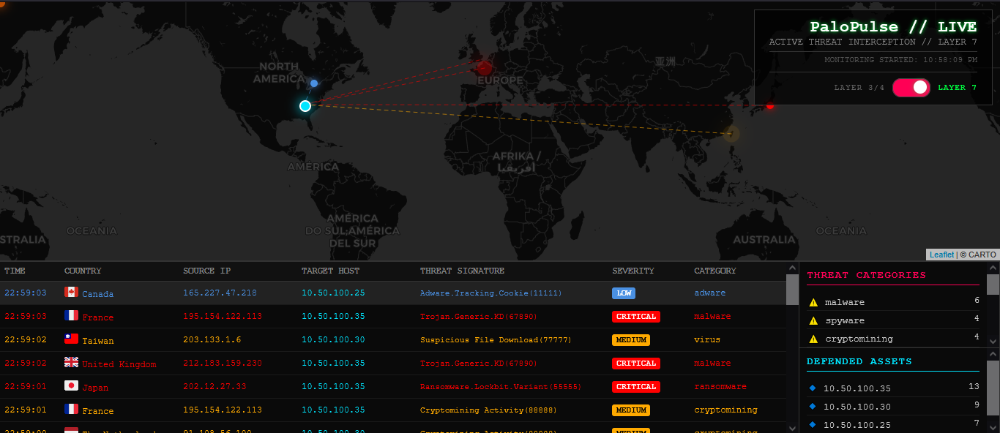

# PaloPulse

Real-time cybersecurity threat visualization dashboard for Palo Alto Networks firewalls.


## Features

- 🗺️ **Live Threat Map** - Real-time geolocation of attacks with animated markers
- 🔄 **Dual Mode Toggle** - Switch between Layer 3/4 Traffic and Layer 7 Threat views
- 🎨 **Color-Coded Events** - Customizable rule-based and severity-based coloring
- 📊 **Live Statistics** - Top attacking countries and defended assets
- 🚨 **Threat Intelligence** - Detailed threat signatures, categories, and severity levels
- 📝 **Comprehensive Logging** - Rotating file logs with configurable verbosity
- ⚡ **High Performance** - Async processing, DNS caching, efficient GeoIP lookups
- 🔍 **CSV-Safe Parsing** - Handles quoted fields with commas in syslog data

## Screenshot



*PaloPulse dashboard showing real-time Layer 7 threat detection with global attack visualization, threat categories, and defended asset statistics.*

## Directory Structure

```
palopulse/
├── main.py                      # Backend server (FastAPI + Socket.IO)
├── config.yaml                  # Configuration file
├── requirements.txt             # Python dependencies
├── test_sender.py              # Test log generator
├── README.md                    # This file
├── templates/
│   └── index.html              # Dashboard frontend
├── static/                     # Static assets (auto-created)
├── logs/                       # Application logs (auto-created)
│   ├── dashboard.log           # Current log file
│   ├── dashboard.log.1         # Rotated log backup
│   ├── dashboard.log.2         # Rotated log backup
│   └── dashboard.log.3         # Rotated log backup
└── GeoLite2-City.mmdb          # GeoIP database (download separately)
```

## Quick Start

### 1. Clone/Download Project
```bash
mkdir palopulse
cd palopulse
```

### 2. Download GeoIP Database
```bash
wget https://github.com/P3TERX/GeoLite.mmdb/raw/download/GeoLite2-City.mmdb
```

### 3. Install Dependencies
```bash
pip install -r requirements.txt
```

### 4. Configure
Edit `config.yaml`:
- Update `home.latitude` and `home.longitude` with your datacenter coordinates
- Customize `rule_colors` to match your firewall rule naming
- Configure `allowed_zones` if you want to filter by source zone
- Enable/disable `logging` as needed

### 5. Run Dashboard
```bash
python main.py
```

### 6. Test with Simulated Traffic
In a separate terminal:
```bash
python test_sender.py
```

### 7. Access Dashboard
Open browser: `http://localhost:8000`

## Configuration Guide

### Network Settings
```yaml
server:
  host: "0.0.0.0"
  web_port: 8000
  udp_ip: "0.0.0.0"
  udp_port: 514      # Standard syslog port
```

### Home Location (Datacenter/Office)
```yaml
home:
  latitude: 36.0103   # Your location latitude
  longitude: -84.2696 # Your location longitude
```

### Log Processing
```yaml
log_types:
  traffic_enabled: true   # Layer 3/4 deny/drop events
  threat_enabled: true    # Layer 7 threat detections
```

### Zone Filtering
```yaml
allowed_zones:
  - "Untrust"
  - "External"
```
Leave empty or comment out to show all zones.

### Color Customization

**Traffic Rules:**
```yaml
rule_colors:
  "#ffe100":  # Yellow
    - "Geo-Block"
    - "Policy-Deny"
  "#bd00ff":  # Purple
    - "Malware"
    - "Spyware"
  "#00e5ff":  # Cyan
    - "Block-Legacy"
```

**Threat Severity:**
```yaml
threat_colors:
  critical: "#ff0000"     # Red
  high: "#ff6600"         # Orange
  medium: "#ffaa00"       # Yellow
  low: "#4a90e2"          # Blue
```

### Logging
```yaml
logging:
  enabled: true
  file_path: "logs/dashboard.log"
  max_size_mb: 5          # Max file size before rotation
  backup_count: 3         # Number of backup files to keep
  level: "INFO"           # DEBUG, INFO, WARNING, ERROR, CRITICAL
```

**Level Descriptions:**
- **DEBUG**: Extremely verbose (every event, DNS lookup, rule match)
- **INFO**: Normal operations (threats detected, stats, startup/shutdown)
- **WARNING**: Unexpected behavior (parsing failures)
- **ERROR**: Non-fatal errors (GeoIP failures, socket errors)
- **CRITICAL**: Fatal errors that stop the application

## Palo Alto Firewall Setup

### Syslog Forwarding Configuration

1. **Create Syslog Server Profile**
   ```
   Device > Server Profiles > Syslog
   - Name: PaloPulse-Syslog
   - Server: <dashboard-server-ip>
   - Port: 514
   - Format: BSD
   ```

2. **Configure Log Forwarding**
   ```
   Objects > Log Forwarding
   - Create new profile
   - Traffic Logs: Forward "deny" actions
   - Threat Logs: Forward "block/reset/drop" actions
   - Select: PaloPulse-Syslog profile
   ```

3. **Apply to Security Policies**
   - Edit your security policies
   - Set Log Forwarding Profile to the one created above
   - Commit changes

### Supported Log Types
- **TRAFFIC logs**: Layer 3/4 firewall deny/drop events
- **THREAT logs**: Layer 7 threat detections (malware, exploits, C2, vulnerabilities)

## Dashboard Controls

### Mode Toggle
Click the **LAYER 3/4 ⟷ LAYER 7** switch in the top-right to toggle between:
- **Traffic Mode (Layer 3/4)**: Shows firewall deny/drop rules
- **Threat Mode (Layer 7)**: Shows malware, exploits, C2 traffic

### Statistics Panels
- **Active Threats** (Left Panel):
  - Traffic Mode: Top attacking countries
  - Threat Mode: Top threat categories
- **Defended Assets** (Right Panel): Most targeted hosts/services

### Map View
- **Blue marker**: Your datacenter/office location
- **Colored pulses**: Incoming attacks (color matches severity/rule)
- **Dashed lines**: Attack trajectory to your location
- Markers auto-clear after 2 seconds

## Troubleshooting

### No Events Appearing
1. **Check firewall syslog configuration**
   - Verify syslog server profile points to correct IP
   - Ensure log forwarding is enabled on security policies
   - Check firewall commits were successful

2. **Verify UDP port 514 is open**
   ```bash
   sudo netstat -unlp | grep 514
   ```

3. **Review logs**
   ```bash
   tail -f logs/dashboard.log
   ```

4. **Enable DEBUG logging**
   ```yaml
   logging:
     level: "DEBUG"
   ```

### GeoIP Database Missing
```bash
wget https://github.com/P3TERX/GeoLite.mmdb/raw/download/GeoLite2-City.mmdb
```

### Performance Issues
- Reduce `max_workers` in `main.py` (line 125): Change from 10 to 5
- Enable zone filtering to reduce event volume
- Set logging level to WARNING or ERROR

### CSV Parsing Errors
PaloPulse uses Python's built-in CSV parser to handle quoted fields that contain commas. If you see parsing warnings in logs, verify your syslog format matches PA-OS standard output.

## Production Deployment

### Enable HTTPS
```yaml
server:
  ssl_enabled: true
  ssl_cert: "/path/to/cert.pem"
  ssl_key: "/path/to/key.pem"
```

Generate self-signed certificate:
```bash
openssl req -x509 -newkey rsa:4096 -nodes -out cert.pem -keyout key.pem -days 365
```

### Run as System Service (systemd)
Create `/etc/systemd/system/palopulse.service`:
```ini
[Unit]
Description=PaloPulse - Palo Alto Threat Dashboard
After=network.target

[Service]
Type=simple
User=palopulse
WorkingDirectory=/opt/palopulse
ExecStart=/usr/bin/python3 /opt/palopulse/main.py
Restart=always
RestartSec=10

[Install]
WantedBy=multi-user.target
```

Enable and start:
```bash
sudo systemctl enable palopulse
sudo systemctl start palopulse
sudo systemctl status palopulse
```

### Reverse Proxy (nginx)
```nginx
server {
    listen 443 ssl;
    server_name palopulse.yourdomain.com;

    ssl_certificate /path/to/cert.pem;
    ssl_certificate_key /path/to/key.pem;

    location / {
        proxy_pass http://localhost:8000;
        proxy_http_version 1.1;
        proxy_set_header Upgrade $http_upgrade;
        proxy_set_header Connection "upgrade";
        proxy_set_header Host $host;
    }
}
```

## Performance Metrics

Tested on modest hardware (4 CPU, 8GB RAM):
- **Events/sec**: 500+
- **CPU Usage**: ~5-10%
- **Memory**: ~100MB
- **DNS Cache Hit Rate**: 85%+
- **Log Rotation**: Automatic at 5MB per file

## Security Considerations

⚠️ **Important Security Notes:**

1. **No Authentication**: PaloPulse has no built-in authentication
   - Run behind reverse proxy with authentication
   - Use firewall rules to restrict access to dashboard port
   - Consider VPN-only access

2. **Network Security**:
   - Bind to specific IP instead of `0.0.0.0` if possible
   - Use HTTPS in production
   - Keep GeoIP database updated

3. **Data Privacy**:
   - Log files contain IP addresses and threat data
   - Rotate and archive logs appropriately
   - Follow your organization's data retention policies

## File Descriptions

| File | Purpose |
|------|---------|
| `main.py` | FastAPI backend with Socket.IO for real-time events |
| `config.yaml` | All configuration settings |
| `requirements.txt` | Python package dependencies |
| `test_sender.py` | Generates simulated syslog traffic for testing |
| `templates/index.html` | Frontend dashboard with Leaflet.js map |
| `GeoLite2-City.mmdb` | MaxMind GeoIP database (not included) |

## Technology Stack

- **Backend**: FastAPI, Socket.IO, asyncio
- **Frontend**: Leaflet.js, Socket.IO client
- **Geolocation**: MaxMind GeoLite2
- **Mapping**: Leaflet.js with CARTO dark tiles
- **Logging**: Python rotating file handler
- **Config**: YAML

## Common Use Cases

1. **Security Operations Center (SOC)**: Real-time threat monitoring on wall displays
2. **Executive Dashboards**: Visual representation of security posture
3. **Incident Response**: Quick identification of attack sources and targets
4. **Training**: Demonstrate live attack patterns to staff
5. **Compliance**: Evidence of active threat monitoring

## Customization Ideas

- Add email/SMS alerts for critical threats
- Integrate with SIEM platforms
- Create historical playback feature
- Add threat intelligence enrichment
- Build custom widgets for specific metrics
- Export data to CSV/JSON for reporting

## Known Limitations

- No persistent storage (events only visible while dashboard is running)
- Limited to UDP syslog input (no TCP or TLS syslog)
- Requires Palo Alto Networks firewall logs (other vendors not supported)
- Single-instance only (no clustering/load balancing)

## FAQ

**Q: Can I use this with Fortinet/Checkpoint/other firewalls?**  
A: Not currently. The log parser is specific to PA-OS CSV format. You would need to modify the field parsing in `main.py`.

**Q: Does this store historical data?**  
A: No. Events are only displayed in real-time. For historical analysis, integrate with a SIEM.

**Q: Can multiple users view the dashboard simultaneously?**  
A: Yes. Socket.IO broadcasts events to all connected clients.

**Q: How much bandwidth does this use?**  
A: Minimal. Each event is ~500 bytes. At 100 events/sec = ~50KB/sec.

**Q: Can I run this on Windows?**  
A: Yes, but you may need to adjust file paths and use `python` instead of `python3`.

**Q: Why "PaloPulse"?**  
A: It captures the heartbeat (pulse) of your Palo Alto Networks security infrastructure in real-time.

## Contributing

Contributions welcome! Areas for improvement:
- Multiple data center coordinates
- Advanced filtering options
- Additional vendor support
- Historical data storage

## License

MIT License - See LICENSE file for details

## Support

For issues or questions:
1. Check logs: `tail -f logs/dashboard.log`
2. Enable DEBUG logging in config.yaml
3. Verify firewall syslog configuration
4. Test with `test_sender.py` to isolate issues

## Acknowledgments

- **Leaflet.js** - Map visualization
- **Socket.IO** - Real-time communication
- **FastAPI** - High-performance web framework
- **MaxMind GeoLite2** - Geolocation database
- **CARTO** - Map tiles

---

**PaloPulse - Feel the heartbeat of your network security.**

*Human-directed, AI-accelerated development.*

*Last Updated: February 2026*
